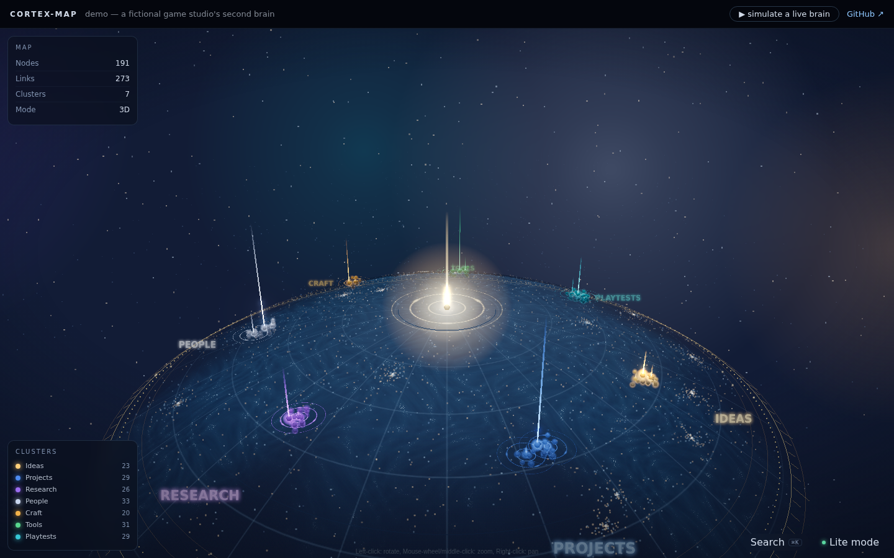
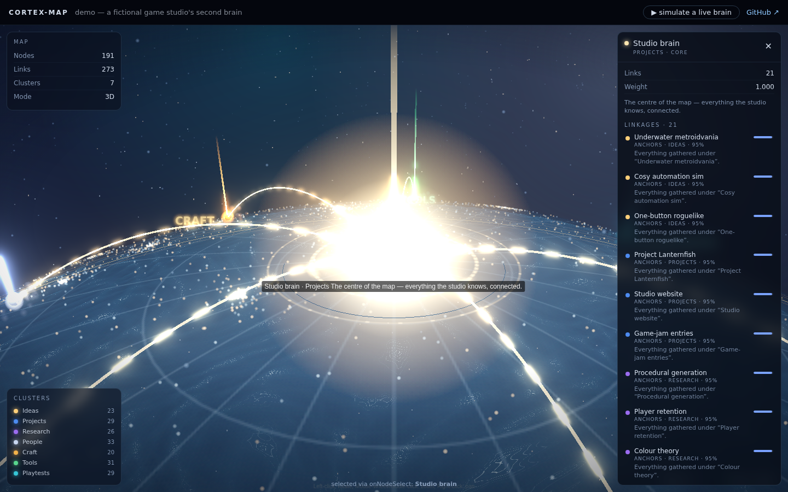
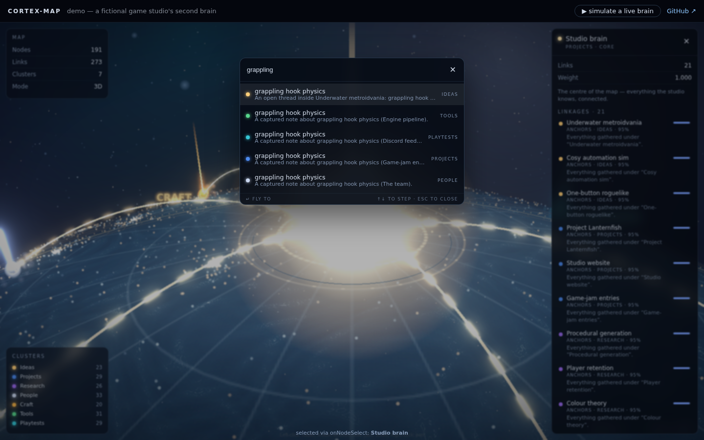

# cortex-map

A cinematic, living 3D knowledge-graph for React — the **"war-table" memory map**.
Bring your own nodes and edges; the clusters, colours, and whole look are yours to theme.



Your data renders as glowing constellations on a holographic table: each cluster
owns a sector, important nodes tower as light pillars, strong connections arc
across the map as bright particle trails, and an animated sea rolls underneath —
rippling and storming where the "mind" is most active. Click an orb and organic
tentacles reach out to everything it's connected to.

**[▶ Live demo](https://cortex-map.pages.dev)** — a fictional game studio's second brain.

| Inspector + connection tentacles | ⌘K search |
| --- | --- |
|  |  |

## Install

```bash
npm install cortex-map
```

React 18+ is a peer dependency. `three` and `react-force-graph-3d` come along as
dependencies — no other setup.

## Quickstart

```tsx
import { CortexMap, type ClusterDef, type CortexMapNode, type CortexMapEdge } from "cortex-map";

const clusters: ClusterDef[] = [
  { name: "Ideas",    color: "#ffcf7a", angleDeg: 30 },
  { name: "Projects", color: "#4d8bf0", angleDeg: 150 },
  { name: "People",   color: "#c9d6ef", angleDeg: 270 },
];

const nodes: CortexMapNode[] = [
  { id: "core", label: "My brain", cluster: "Projects", role: "core", weight: 1 },
  { id: "i1", label: "Underwater metroidvania", cluster: "Ideas", role: "hub", parentId: "core" },
  { id: "n1", label: "grappling hook physics", cluster: "Ideas", parentId: "i1",
    summary: "Rope constraint notes", lastSeenAt: Date.now() },
  // …
];

const edges: CortexMapEdge[] = [
  { source: "core", target: "i1", relation: "anchors", strength: 0.95 },
  { source: "i1", target: "n1", relation: "contains", strength: 0.8 },
  // cross-cluster "semantic" links arc across the map as the bright thinking tier:
  { source: "n1", target: "p2", relation: "similar to", strength: 0.93, origin: "semantic" },
];

export function Brain() {
  return (
    <div style={{ width: "100vw", height: "100vh" }}>
      <CortexMap nodes={nodes} edges={edges} clusters={clusters} />
    </div>
  );
}
```

The component fills its parent — give the parent a real height.

## Data model

See **[docs/data-format.md](docs/data-format.md)** for the full contract. The short version:

- **Node**: `{ id, label, cluster, summary?, weight? (0..1), role? ("core"|"hub"|"subhub"|"leaf"), parentId?, lastSeenAt? }`
  - `role`/`parentId` shape the layout: one `core` sits at the centre, `hub`s anchor
    their cluster's sector, children ring their parent. Everything is optional —
    plain nodes fall back to a tidy golden-spiral constellation per cluster.
  - `lastSeenAt` drives the **age gradient**: fresh memories glow vivid and ride
    proud of the surface; old ones cool toward slate and settle.
- **Edge**: `{ source, target, relation?, strength? (0..1), origin? ("explicit"|"semantic") }`
  - Strong edges join the bright particle tier; weak ones form the faint fibre web.

Layout is **deterministic** — the same data always renders the same map, so the
map becomes a place you learn.

## Theming — colours, clusters, camera, everything

Clusters are fully yours: name, colour, angular position on the disc, and a
"persona" (how fast its rings spin, how big its halos glow, how readily it storms):

```tsx
const clusters: ClusterDef[] = [
  { name: "Research", color: "#9b6cf0", angleDeg: 130,
    persona: { ringRate: 0.6, halo: 1.1, volatility: 0.25 } },
];
```

The scene itself takes a `theme` prop — every field optional, defaults reproduce
the look in the screenshots:

```tsx
<CortexMap
  …
  theme={{
    background: "#04060d",
    flashColor: "#fff4d6",   // the "memory touched" pulse colour
    sea: true,               // the animated ocean (heaviest furniture)
    starfield: true,
    bloom: [0.55, 0.5, 0.82],
    cameraStart: { x: 0, y: 540, z: 1240 },
  }}
/>
```

The full knob list — and recipes for common looks (clean/minimal, high-energy,
custom fonts via CSS variables) — is in **[docs/theming.md](docs/theming.md)**.

## Live effects — make it feel alive

Grab the imperative handle to flash and ignite nodes as your data changes
(webhooks, SSE, polling — whatever you have):

```tsx
const map = useRef<CortexMapHandle>(null);

<CortexMap ref={map} … />

// a new memory arrived:
map.current?.flash("node-id");        // warm pulse + a ripple in the sea
// a retrieval touched several nodes:
map.current?.ignite(["a", "b", "c"]); // chain-reaction spread along the edges
map.current?.focus("node-id");        // fly the camera to a node
```

Sustained activity in one cluster builds a **storm** in the sea at that cluster's
sector — the map literally shows where the mind is working hardest.

## Built-in UI

- **⌘K search** — instant fuzzy search over labels + summaries, Enter flies to the hit
- **Node inspector** — click an orb: connections ranked by strength, click-through navigation
- **Proximity picker** — a click in a dense cluster lists every orb packed at that spot
- **Double-click** — cinematic two-leg camera swoop to the node
- **Lite mode** — flat 2D fallback for low-power devices (auto on small screens,
  forced by `prefers-reduced-motion`, toggleable)

All optional — `search={false}` / `inspector={false}` and bring your own via
`onNodeSelect`.

## Performance

This scene is heavily optimised (it started life rendering a real 600-node
personal memory graph): render-on-demand with a sleeping loop, raycast exclusion
for all decorative furniture, geometry-stable accessors, shared shader clocks,
capped device-pixel-ratio, and a GPU-only ambient loop for the water. Expect
smooth interaction with a few hundred to a couple of thousand nodes.

## Hosted version — interested?

We're gauging interest in a **hosted brain backend**: connect your data sources,
we handle storage, embeddings, and automatic semantic linking — your map stays
this component, pointed at our API.

**[→ Join the waitlist](https://github.com/NoctemJack/cortex-map/issues/1)** (a 👍 is enough).

## Development

```bash
npm install
npm run dev        # demo app on http://localhost:5173
npm run typecheck
npm run build      # package (tsup) + demo (vite)
```

The demo consumes the package source directly — edit `packages/cortex-map/src/`
and the dev server hot-reloads.

## License

[MIT](LICENSE)
